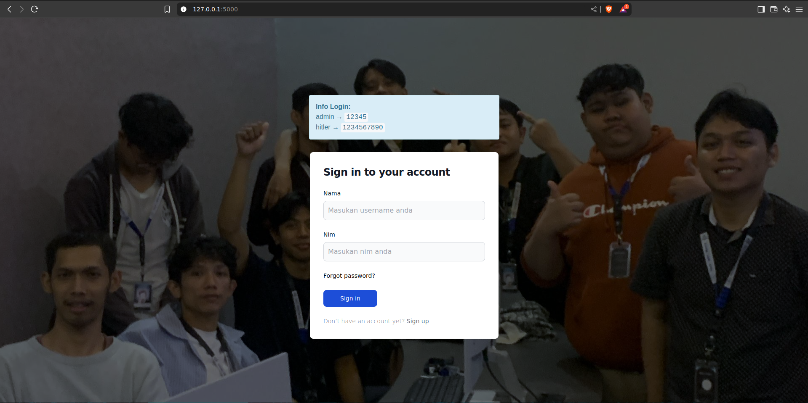
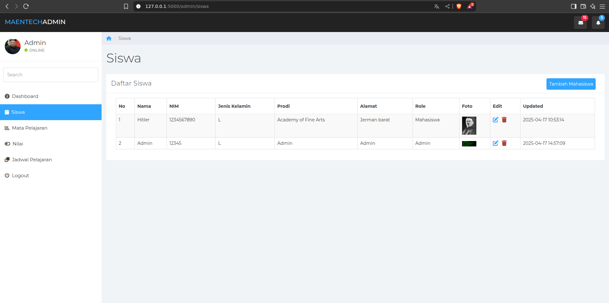
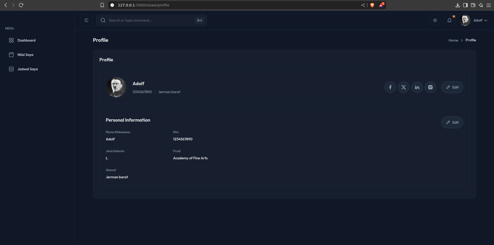

<h2>Tampilan Aplikasi</h2>

<h3>Tampilan Admin</h3>
<table>
  <tr>
    <td></td>
    <td></td>
    <td></td>
    <td></td>
  </tr>
</table>

<h3>Tampilan User</h3>
<table>
  <tr>
    <td></td>
    <td></td>
    <td></td>
    <td></td>
  </tr>
</table>

## 📢 Catatan Keamanan
⚠️ **Penting**: Web ini sengaja dibuat dengan celah atau kerentanannya untuk tujuan **Penetration Testing** dan **Security Engineering**. Oleh karena itu, tidak disarankan untuk digunakan dalam aplikasi produksi tanpa perbaikan dan pengamanan yang sesuai.

## Project Structure

### Backend
- **Language**: Python - Semiframework flask
- **Functionality**: Handles all the business logic, database interactions, and routing.

### Frontend
- **Templates**: HTML files powered by Jinja2 for rendering dynamic content.

## Status
- **Done**

